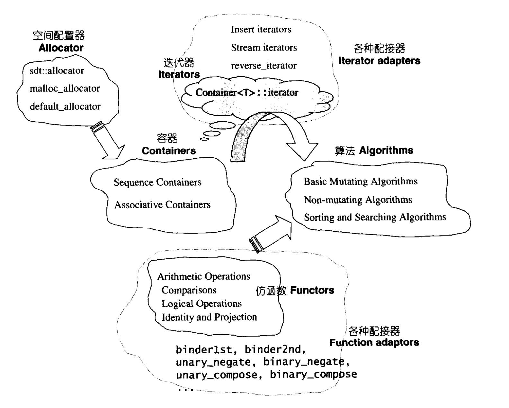

STL源码剖析入门
=============================================================

+---------+-----------------+
| Author  | Guodong Zhu     |
+---------+-----------------+
| Version | 1.0.0           |
+---------+-----------------+

STL组件分布图
-------------------------------

*图片来源：侯捷《STL源码剖析》*

CGI STL源码文件列表
-------------------------------

.. code-block:: console

    algo.h                 pair.h                 stl_iterator_base.h
    algobase.h             pthread_alloc          stl_list.h
    algorithm              pthread_alloc.h        stl_map.h
    alloc.h                queue                  stl_multimap.h
    bitset                 rope                   stl_multiset.h
    bvector.h              rope.h                 stl_numeric.h
    char_traits.h          ropeimpl.h             stl_pair.h
    concept_checks.h       sequence_concepts.h    stl_queue.h
    container_concepts.h   set                    stl_range_errors.h
    defalloc.h             set.h                  stl_raw_storage_iter.h
    deque                  slist                  stl_relops.h
    deque.h                slist.h                stl_rope.h
    function.h             stack                  stl_set.h
    functional             stack.h                stl_slist.h
    hash_map               stdexcept              stl_stack.h
    hash_map.h             stl_algo.h             stl_string_fwd.h
    hash_set               stl_algobase.h         stl_tempbuf.h
    hash_set.h             stl_alloc.h            stl_threads.h
    hashtable.h            stl_bvector.h          stl_tree.h
    heap.h                 stl_config.h           stl_uninitialized.h
    iterator               stl_construct.h        stl_vector.h
    iterator.h             stl_ctraits_fns.h      string
    limits                 stl_deque.h            tempbuf.h
    list                   stl_exception.h        tree.h
    list.h                 stl_function.h         type_traits.h
    map                    stl_hash_fun.h         utility
    map.h                  stl_hash_map.h         valarray
    memory                 stl_hash_set.h         vector
    multimap.h             stl_hashtable.h        vector.h
    multiset.h             stl_heap.h
    numeric                stl_iterator.h

